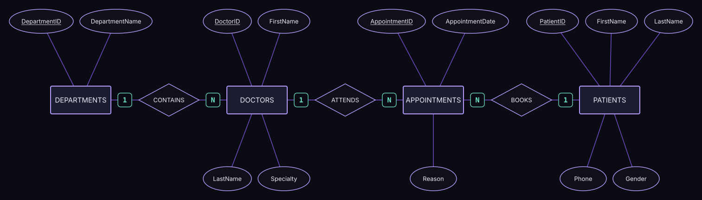

# Hospital Database and ERD

A hospital management database in SQL Server, together with the Entity Relationship Diagram (ERD) it is based on. It models doctors, departments, patients, and appointments, and demonstrates all four main types of JOIN.

## ERD



The diagram (Chen notation) has four entities and three relationships:

| Relationship | Connects | Cardinality | Meaning |
|---|---|---|---|
| `CONTAINS` | Departments → Doctors | 1 : N | A department contains many doctors |
| `ATTENDS` | Doctors → Appointments | 1 : N | A doctor attends many appointments |
| `BOOKS` | Patients → Appointments | 1 : N | A patient books many appointments |

Each entity lists the same columns as the SQL tables, and primary keys are underlined.

## Database schema

| Table | Key columns |
|---|---|
| `Departments` | `DepartmentID` (PK), `DepartmentName` |
| `Doctors` | `DoctorID` (PK), `FirstName`, `LastName`, `Specialty`, `DepartmentID` (FK) |
| `Patients` | `PatientID` (PK), `FirstName`, `LastName`, `Phone`, `Gender` |
| `Appointments` | `AppointmentID` (PK, auto-increment), `PatientID` (FK, nullable), `DoctorID` (FK, nullable), `AppointmentDate`, `Reason` |

`PatientID` is nullable on purpose, so an emergency walk-in can be recorded before the patient is registered. The sample data includes one such appointment.

## Sample data

4 departments, 3 doctors, 3 patients, and 4 appointments (one is a walk-in with no patient).

## JOIN examples

| Join | What it shows |
|---|---|
| `INNER JOIN` | Appointments with patient and doctor names. The walk-in is left out because it has no patient. |
| `LEFT JOIN` | Every patient with their appointments, including patients with none. |
| `RIGHT JOIN` | Every department with its doctors, including departments with no doctors. |
| `FULL OUTER JOIN` | All patients and all appointments, matched where possible. |

```sql
SELECT Patients.FirstName AS PatientName,
       Appointments.AppointmentDate
FROM Patients
FULL OUTER JOIN Appointments
  ON Patients.PatientID = Appointments.PatientID
```

## Files

- `HospitalDB.sql`: creates the database, tables, sample data, and runs the JOIN queries.
- `erd.svg`: the ERD image shown above.
- `Hospital_ERD.drawio`: the editable diagram. Open it at [app.diagrams.net](https://app.diagrams.net).

## How to run

1. Open `HospitalDB.sql` in SQL Server Management Studio or Azure Data Studio.
2. Run the whole script.

## Concepts practiced

Entity-relationship modeling, primary and foreign keys, nullable foreign keys, `IDENTITY` columns, and `INNER`, `LEFT`, `RIGHT`, and `FULL OUTER` joins.

## Author

**Youssif Elhadad**, Computer and Information Science student at Mansoura University, aspiring Data Engineer.
[LinkedIn](https://www.linkedin.com/in/youssif-nasser-elhadad/) · [GitHub](https://github.com/JoeElhadad0) · youssifelhadad@gmail.com
